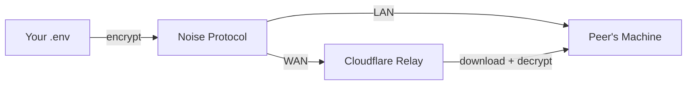

# EnvSync

> **Securely sync `.env` files between developers. Zero accounts. Zero servers. End-to-end encrypted.**

EnvSync uses your existing SSH keys for identity and trust. No accounts, no SaaS, no plaintext secrets in the cloud.

## Quick Start

```bash
# 1. Install
curl -fsSL https://envsync.dev/install.sh | bash

# 2. Initialize (reads your SSH key)
envsync init

# 3. Invite a teammate
envsync invite @alice
# Share the 6-word code → Alice runs: envsync join <code>

# 4. Sync
envsync push    # Send .env to team
envsync pull    # Receive .env from team
```

## How It Works



1. **Identity** — Your Ed25519 SSH key is your identity. No accounts needed.
2. **Discovery** — Peers on the same LAN are found via mDNS (`_envsync._tcp.local`).
3. **Encryption** — All data encrypted with Noise_XX (X25519 + ChaCha20-Poly1305).
4. **Relay** — Offline peers receive via encrypted blobs on a Cloudflare Worker (72h TTL, 64KB max).
5. **Trust** — TOFU model. First connection prompts fingerprint verification.

## Commands

| Command | Description |
|---------|-------------|
| `envsync init` | Initialize with your SSH key |
| `envsync push` | Push `.env` to peers |
| `envsync pull` | Listen for incoming pushes |
| `envsync diff` | Compare local vs synced |
| `envsync invite @user` | Create team invite |
| `envsync join <code>` | Join team with invite code |
| `envsync peers` | List team members |
| `envsync revoke @user` | Remove peer from team |
| `envsync backup` | Encrypted backup |
| `envsync restore` | Restore from backup |
| `envsync audit` | View sync history |

## Security

| Layer | Primitive |
|-------|-----------|
| Identity | Ed25519 SSH keys |
| Key Exchange | X25519 (Curve25519 ECDH) |
| Channel | Noise_XX handshake |
| Encryption | XChaCha20-Poly1305 |
| Key Derivation | HKDF-SHA256 |
| At-Rest | XChaCha20-Poly1305 + HKDF |
| Signatures | Ed25519 (ES-SIG) |
| Relay | Ephemeral ECDH per-recipient |

**Zero-knowledge relay** — The relay server never has access to your secrets. All blobs are encrypted client-side with recipient-specific ephemeral keys.

## Install

### macOS / Linux
```bash
curl -fsSL https://envsync.dev/install.sh | bash
```

### Windows (PowerShell)
```powershell
irm https://envsync.dev/install.ps1 | iex
```

### From Source
```bash
go install github.com/envsync/envsync@latest
```

## Architecture

```
Transport Layer:  mDNS (LAN) → TCP Hole-Punch (WAN) → CF Relay (Async)
Crypto Layer:     Ed25519 → X25519 → Noise_XX → XChaCha20-Poly1305
Trust Layer:      TOFU → Fingerprint Verification → Peer Registry
Storage Layer:    Encrypted JSONL audit + versioned .enc backups
```

## License

MIT © EnvSync Contributors
