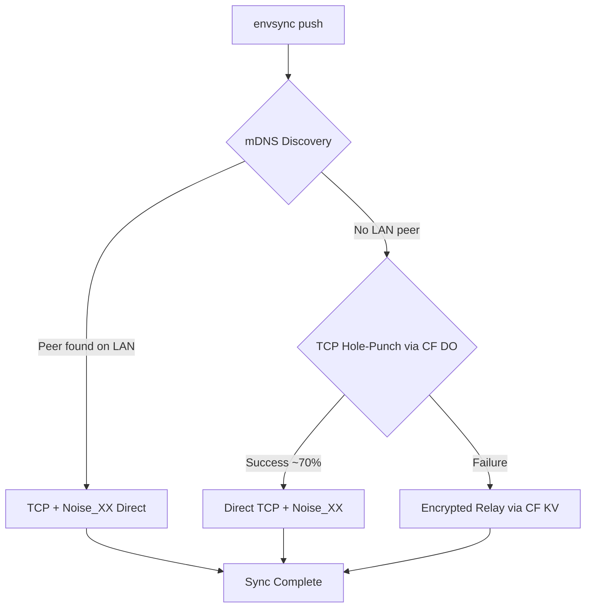
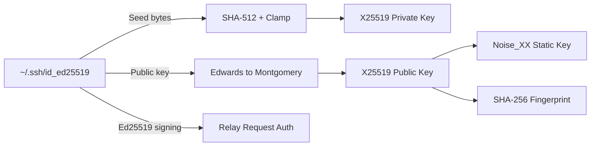

# EnvSync — Deep Project Analysis

**Date:** 2026-02-28  
**Scope:** Complete codebase, documentation, architecture, security, and implementation review

---

## 1. Executive Summary

EnvSync is a **peer-to-peer `.env` file synchronization tool** that leverages existing SSH Ed25519 keys for identity and the Noise Protocol Framework for encryption. It targets a zero-account, zero-server developer experience with a three-layer transport fallback: LAN mDNS → WAN TCP hole-punch → Cloudflare Workers relay.

**Current State:** The project is approximately **65% implemented** against its documented feature set. Core cryptography, LAN sync, the relay server, and the wire protocol are functional. TCP hole-punching, full relay integration in the orchestrator, interactive conflict resolution, and several CLI commands remain incomplete.

---

## 2. Architecture Assessment

### 2.1 Three-Layer Transport



| Layer | Status | Latency Target | Implementation |
|-------|--------|---------------|----------------|
| LAN Direct | ✅ Implemented | <500ms | [`internal/discovery/mdns.go`](internal/discovery/mdns.go) + [`internal/transport/direct.go`](internal/transport/direct.go) |
| WAN Hole-Punch | ❌ TODO | ~800ms | [`internal/sync/orchestrator.go`](internal/sync/orchestrator.go:112) — explicit `// TODO: Implement in D17` |
| Async Relay | ⚠️ Partial | <3s | Server: [`relay/src/routes/relay.ts`](relay/src/routes/relay.ts) ✅ / Client: [`internal/relay/client.go`](internal/relay/client.go) ✅ / Orchestrator integration: ❌ |

**Key Finding:** The orchestrator at [`internal/sync/orchestrator.go:116-131`](internal/sync/orchestrator.go:116) has a stub relay fallback that returns an error rather than actually uploading. The relay client code exists and is complete, but it is not wired into the push/pull flow.

### 2.2 Cryptographic Identity Chain



The conversion is implemented in [`internal/crypto/keys.go`](internal/crypto/keys.go) and [`internal/crypto/curve.go`](internal/crypto/curve.go). The Edwards-to-Montgomery conversion uses `big.Int` arithmetic for the formula `u = (1 + y) / (1 - y) mod p`. This is correct but not constant-time — acceptable since public keys are not secret.

### 2.3 Wire Protocol

Defined in [`internal/sync/protocol.go`](internal/sync/protocol.go):

| Message Type | Code | Purpose |
|-------------|------|---------|
| `ENV_PUSH` | `0x01` | Push `.env` content |
| `ENV_PULL_REQ` | `0x02` | Request `.env` |
| `ENV_PULL_RESP` | `0x03` | Response to pull |
| `ACK` | `0x10` | Acknowledgment |
| `NACK` | `0x11` | Rejection with reason |
| `PEER_INFO` | `0x20` | Metadata exchange |
| `PING/PONG` | `0x30/0x31` | Keep-alive |

The payload encoding uses big-endian binary with SHA-256 checksums. Round-trip tests pass in [`internal/sync/protocol_test.go`](internal/sync/protocol_test.go).

---

## 3. Package-by-Package Analysis

### 3.1 `internal/crypto` — Cryptographic Core

| File | LOC | Purpose | Quality | Issues |
|------|-----|---------|---------|--------|
| [`keys.go`](internal/crypto/keys.go) | 204 | SSH key loading, Ed25519→X25519 | **Excellent** | None |
| [`curve.go`](internal/crypto/curve.go) | 81 | Edwards→Montgomery conversion | **Good** | Uses `big.Int` — not constant-time, but acceptable for public keys |
| [`noise.go`](internal/crypto/noise.go) | 209 | Noise_XX handshake | **Good** | See Bug #1 below |
| [`encrypt.go`](internal/crypto/encrypt.go) | 215 | At-rest + relay encryption | **Excellent** | Proper HKDF domain separation |
| [`signature.go`](internal/crypto/signature.go) | 89 | Ed25519 request signing | **Good** | 5-minute replay window |
| [`service_key.go`](internal/crypto/service_key.go) | 75 | CI service keys | **Good** | Clean PEM format |
| [`x25519.go`](internal/crypto/x25519.go) | 10 | Thin wrapper | **Fine** | — |

**Bug #1 — Noise Handshake Variable Shadowing:** In [`noise.go:82-91`](internal/crypto/noise.go:82), the initiator path declares `msg3, sendCS, recvCS, err := hs.WriteMessage(...)` with `:=`, which **shadows** the outer `sendCS` and `recvCS` variables declared at line 50. The `_ = sendCS` and `_ = recvCS` at lines 90-91 suppress the compiler warning, but the outer variables remain `nil`. The `SecureConn` returned at line 132 will have `nil` cipher states, causing panics on first `Send()` or `Receive()` call.

This is a **critical bug** that would crash the initiator side of any Noise handshake. The responder path at line 118 correctly uses `=` instead of `:=`.

**Fix:** Change line 82 from `:=` to `=`:
```go
msg3, sendCS, recvCS, err = hs.WriteMessage(nil, nil)
```

**Test Coverage:** 9 tests in [`encrypt_test.go`](internal/crypto/encrypt_test.go) covering:
- Encrypt/decrypt round-trip ✅
- Wrong key rejection ✅
- Corrupt data detection ✅
- Short data handling ✅
- Bad magic bytes ✅
- HKDF determinism ✅
- Recipient encryption/decryption ✅
- Wrong recipient rejection ✅
- Signature round-trip + tamper detection ✅

### 3.2 `internal/envfile` — Parser & Diff

| File | LOC | Purpose | Quality |
|------|-----|---------|---------|
| [`parser.go`](internal/envfile/parser.go) | 349 | Full `.env` parser | **Good** |
| [`writer.go`](internal/envfile/writer.go) | ~80 | Round-trip writer | **Good** |
| [`diff.go`](internal/envfile/diff.go) | 102 | Two-way diff | **Good** |
| [`merge.go`](internal/envfile/merge.go) | 168 | Three-way merge | **Good** |

**Parser Capabilities:**
- ✅ Basic `KEY=value`
- ✅ Spaces around `=`
- ✅ `export` prefix stripping
- ✅ Single quotes (verbatim)
- ✅ Double quotes (escape sequences: `\n`, `\r`, `\t`, `\\`, `\"`)
- ✅ Inline comments (`# ...` after space)
- ✅ Hash inside quotes preserved
- ✅ Multiline double-quoted values
- ✅ Empty values
- ✅ Round-trip preservation (comments, blank lines, ordering)

**Parser Gaps:**
- ❌ Variable interpolation (`${VAR}`) — documented as "optional, configurable" but not implemented
- ❌ Backtick-quoted values (used by some frameworks)
- ❌ BOM handling (mentioned in build plan but not tested)
- ❌ CRLF normalization (mentioned in build plan but not tested)

**Three-Way Merge:** The [`merge.go`](internal/envfile/merge.go) implementation handles 12 distinct merge scenarios including delete-vs-modify conflicts. This is more complete than expected — the merge logic itself is solid. What's missing is the **interactive UI** for resolving conflicts (the merge defaults to "ours" for conflicts).

**Test Coverage:** 15 tests in [`parser_test.go`](internal/envfile/parser_test.go) + merge tests in [`merge_test.go`](internal/envfile/merge_test.go).

### 3.3 `internal/discovery` — Peer Discovery

| File | LOC | Purpose | Quality |
|------|-----|---------|---------|
| [`mdns.go`](internal/discovery/mdns.go) | 201 | mDNS advertisement + discovery | **Good** |
| [`github.go`](internal/discovery/github.go) | ~150 | GitHub public key fetching | **Good** |

The mDNS implementation uses `hashicorp/mdns` with TXT records carrying fingerprint, team ID, and version. Self-discovery is filtered out by comparing fingerprints. IPv4 is preferred over IPv6.

**Potential Issue:** The `Discover()` function at [`mdns.go:99`](internal/discovery/mdns.go:99) uses `mdns.Query()` which is blocking. The context deadline is used to set the timeout, but there's no way to cancel mid-query if the context is cancelled externally.

### 3.4 `internal/transport` — Connection Layer

| File | LOC | Purpose | Quality |
|------|-----|---------|---------|
| [`direct.go`](internal/transport/direct.go) | 100 | TCP dial + Noise handshake | **Good** |
| [`listener.go`](internal/transport/listener.go) | 158 | TCP accept + Noise handshake | **Good** |

The listener uses a polling accept loop with 500ms deadlines to check for context cancellation. This is a standard Go pattern. The TOFU verification callback is properly threaded through.

**Missing:** `holepunch.go` — referenced in the build plan but not present in the codebase.

### 3.5 `internal/sync` — Orchestration

| File | LOC | Purpose | Quality |
|------|-----|---------|---------|
| [`orchestrator.go`](internal/sync/orchestrator.go) | 149 | Fallback chain | **Incomplete** |
| [`push.go`](internal/sync/push.go) | 168 | Push flow | **Good** |
| [`pull.go`](internal/sync/pull.go) | 182 | Pull flow | **Good** |
| [`protocol.go`](internal/sync/protocol.go) | 225 | Wire protocol | **Good** |
| [`resolver.go`](internal/sync/resolver.go) | ~40 | Conflict resolution | **Stub** |

The push flow at [`push.go`](internal/sync/push.go) works end-to-end for LAN: discover peers → TCP connect → Noise handshake → send payload → wait for ACK. The pull flow at [`pull.go`](internal/sync/pull.go) listens, accepts, verifies checksum, computes diff, and writes the file.

**Issue:** The `VarCount` in [`push.go:75-79`](internal/sync/push.go:75) counts `=` characters in the raw bytes rather than parsing the file. This will over-count if values contain `=` (e.g., base64 strings).

### 3.6 `internal/relay` — Relay Client

| File | LOC | Purpose | Quality |
|------|-----|---------|---------|
| [`client.go`](internal/relay/client.go) | 349 | Full HTTP client | **Good** |
| [`billing.go`](internal/relay/billing.go) | ~70 | Stripe integration | **Stub** |

The relay client is well-implemented with:
- ✅ Automatic retry (3 attempts, exponential backoff)
- ✅ Request signing via Ed25519
- ✅ Invite CRUD
- ✅ Blob upload/download/delete
- ✅ Team member management
- ✅ Pending blob listing

### 3.7 `internal/peer` — Trust Registry

| File | LOC | Purpose | Quality |
|------|-----|---------|---------|
| [`peer.go`](internal/peer/peer.go) | 116 | Peer struct + trust state machine | **Good** |
| [`registry.go`](internal/peer/registry.go) | 227 | Filesystem-backed peer storage | **Good** |

Trust state machine: `Unknown → Pending → Trusted → Revoked` with proper validation. Registry uses TOML files under `~/.envsync/teams/{team_id}/peers/`. Thread-safe with `sync.RWMutex`.

**Test Coverage:** 4 tests in [`peer_test.go`](internal/peer/peer_test.go) covering state machine transitions, persistence round-trip, nonexistent team handling, and status icons.

### 3.8 `internal/store` — Version Store

[`store.go`](internal/store/store.go) (195 LOC) — Encrypted version history with automatic rotation. Files stored as `{sequence}_{timestamp}.enc` with XChaCha20-Poly1305 encryption. Supports save, restore, list, and rotation (keep last N versions).

### 3.9 `internal/audit` — Audit Logger

[`logger.go`](internal/audit/logger.go) (175 LOC) — Append-only JSONL audit log with filtering by peer and event type. Events: push, pull, invite, join, revoke, conflict_resolved, backup, restore.

### 3.10 `internal/ui` — Terminal UI

[`theme.go`](internal/ui/theme.go) (123 LOC) — Lipgloss-based theme with brand colors, icon constants, and box styles. Respects `NO_COLOR` and `TERM=dumb`.

**Issue:** [`TerminalWidth()`](internal/ui/theme.go:106) returns a hardcoded `120` instead of detecting actual terminal width. Should use `lipgloss.Width()` or `term.GetSize()`.

### 3.11 `internal/config` — Configuration

[`config.go`](internal/config/config.go) (188 LOC) — TOML-based config with platform-aware paths:
- Windows: `%APPDATA%\envsync\`
- macOS: `~/Library/Application Support/envsync/`
- Linux: `~/.config/envsync/` (XDG) or `~/.envsync/`

**Missing:** Config file loading/saving (the struct and defaults exist, but there's no `Load()` or `Save()` function that reads/writes TOML).

---

## 4. Relay Server Analysis

### 4.1 Architecture

The relay is a Cloudflare Worker using Hono framework, deployed at [`relay/src/index.ts`](relay/src/index.ts):

```mermaid
graph TD
    A[Hono Router] --> B[/health]
    A --> C[/invites]
    A --> D[/relay/:team/:blob]
    A --> E[/teams/:team/members]
    A --> F[/billing]
    A --> G[Durable Object: SignalingRoom]
```

### 4.2 Route Analysis

| Route | Method | Purpose | Auth | Rate Limit |
|-------|--------|---------|------|------------|
| `/health` | GET | Health check | None | None |
| `/invites` | POST/GET/DELETE | Invite CRUD | ES-SIG | 10/hr per user |
| `/relay/:team/:blob` | PUT | Upload blob | ES-SIG | 10/day per team |
| `/relay/:team/pending` | GET | List pending | ES-SIG | None |
| `/relay/:team/:blob` | GET | Download blob | ES-SIG | None |
| `/relay/:team/:blob` | DELETE | Cleanup | ES-SIG | None |
| `/teams/:team/members` | CRUD | Team management | ES-SIG | None |
| `/billing` | Various | Stripe integration | ES-SIG | None |

### 4.3 Relay Issues

1. **Auth middleware not applied:** The [`relay/src/middleware/auth.ts`](relay/src/middleware/auth.ts) exists but is not mounted in [`index.ts`](relay/src/index.ts). Routes are unprotected.

2. **Pending list race condition:** In [`relay.ts:66-70`](relay/src/routes/relay.ts:66), the pending list is read, modified, and written back non-atomically. Two concurrent uploads for the same recipient could lose one entry.

3. **No blob count enforcement:** The rate limit checks blob uploads per day but doesn't enforce the "100 active blobs per team" limit documented in the architecture.

---

## 5. CLI Commands Analysis

| Command | File | Status | Notes |
|---------|------|--------|-------|
| `init` | [`cmd/init.go`](cmd/init.go) | ✅ Complete | SSH key detection, config creation |
| `push` | [`cmd/push.go`](cmd/push.go) | ✅ LAN only | No relay fallback wired |
| `pull` | [`cmd/pull.go`](cmd/pull.go) | ✅ LAN only | No relay check |
| `diff` | [`cmd/diff.go`](cmd/diff.go) | ✅ Complete | Local vs synced comparison |
| `invite` | [`cmd/invite.go`](cmd/invite.go) | ⚠️ Partial | GitHub key fetch + relay POST |
| `peers` | [`cmd/peers.go`](cmd/peers.go) | ✅ Complete | Table display |
| `revoke` | [`cmd/revoke.go`](cmd/revoke.go) | ⚠️ Partial | Local only, no relay notification |
| `backup` | [`cmd/backup.go`](cmd/backup.go) | ✅ Complete | Encrypted local backup |
| `restore` | [`cmd/restore.go`](cmd/restore.go) | ✅ Complete | Version selection + restore |
| `audit` | [`cmd/audit.go`](cmd/audit.go) | ✅ Complete | JSONL log viewer |
| `version` | [`cmd/version.go`](cmd/version.go) | ✅ Complete | Semver + git info |
| `upgrade` | [`cmd/upgrade.go`](cmd/upgrade.go) | ⚠️ Stub | Opens browser to Stripe |
| `service-key` | [`cmd/service_key.go`](cmd/service_key.go) | ✅ Complete | Generate/export CI keys |
| `join` | — | ❌ Missing | Not implemented as a command |
| `status` | — | ❌ Missing | Not implemented |

---

## 6. Security Deep Dive

### 6.1 Cryptographic Correctness

| Operation | Implementation | Verdict |
|-----------|---------------|---------|
| Ed25519→X25519 private | SHA-512 of seed, first 32 bytes, clamped | ✅ Correct per RFC 7748 |
| Ed25519→X25519 public | `u = (1+y)/(1-y) mod p` | ✅ Correct birational map |
| Noise_XX handshake | `flynn/noise` with X25519 + ChaChaPoly + SHA256 | ⚠️ Bug #1 (variable shadowing) |
| At-rest encryption | XChaCha20-Poly1305, HKDF-SHA256 key derivation | ✅ Correct |
| Relay encryption | Ephemeral ECDH + HKDF + XChaCha20-Poly1305 | ✅ Correct |
| Request signing | Ed25519 over `method\npath\ntimestamp\nbody_sha256` | ✅ Correct |

### 6.2 Threat Model Gaps

1. **No sequence number validation on pull:** The pull flow at [`pull.go`](internal/sync/pull.go) verifies the checksum but does not check the sequence number against the last known sequence. A replay of an older push would be accepted.

2. **TOFU accepts all peers on pull:** At [`pull.go:70-72`](internal/sync/pull.go:70), the `VerifyPeer` callback returns `nil` for all connections — it accepts any peer, not just trusted ones. This bypasses the trust registry entirely.

3. **No relay auth middleware mounted:** As noted in §4.3, the auth middleware exists but isn't applied to routes.

4. **Passphrase-protected keys rejected:** At [`keys.go:54-57`](internal/crypto/keys.go:54), passphrase-protected SSH keys cause an error suggesting the user remove the passphrase. This is a security anti-pattern — the tool should support passphrase-protected keys via `ssh-agent` or interactive prompt.

### 6.3 Supply Chain

| Dependency | Version | CVE Status | License |
|-----------|---------|------------|---------|
| `spf13/cobra` | v1.10.2 | Clean | Apache-2.0 |
| `charmbracelet/lipgloss` | v1.1.0 | Clean | MIT |
| `flynn/noise` | v1.1.0 | Clean | BSD-3 |
| `hashicorp/mdns` | v1.0.6 | Clean | MIT |
| `pelletier/go-toml/v2` | v2.2.4 | Clean | Apache-2.0 |
| `golang.org/x/crypto` | v0.48.0 | Clean | BSD-3 |

8 direct dependencies, ~15 transitive. Minimal attack surface.

---

## 7. Test Coverage Analysis

| Package | Test File | Test Count | Coverage Estimate |
|---------|-----------|------------|-------------------|
| `crypto` | [`encrypt_test.go`](internal/crypto/encrypt_test.go) | 9 | ~70% |
| `envfile` | [`parser_test.go`](internal/envfile/parser_test.go) | 15 | ~75% |
| `envfile` | [`merge_test.go`](internal/envfile/merge_test.go) | ~5 | ~60% |
| `sync` | [`protocol_test.go`](internal/sync/protocol_test.go) | 3 | ~40% |
| `peer` | [`peer_test.go`](internal/peer/peer_test.go) | 4 | ~65% |
| **Total** | | **~36** | **~55%** |

**Missing Test Coverage:**
- No tests for `transport/` (listener, direct dial)
- No tests for `discovery/mdns.go` (requires network)
- No tests for `relay/client.go`
- No tests for `store/store.go`
- No tests for `audit/logger.go`
- No tests for `config/config.go`
- No integration tests (the `test/integration/` directory doesn't exist)
- No relay tests (the `relay/test/` directory doesn't exist)

---

## 8. Build & Distribution

### 8.1 Build System

[`Makefile`](Makefile) provides:
- `build` — Single binary with ldflags for version info
- `test` — Unit tests with race detector
- `test-crypto` — Crypto tests run 10x
- `test-integration` — Integration tests (directory missing)
- `lint` — golangci-lint
- `ci` — Full pipeline

[`.goreleaser.yml`](.goreleaser.yml) configured for:
- 6 targets: linux/darwin/windows × amd64/arm64
- CGO_ENABLED=0 (static binaries)
- tar.gz for Unix, zip for Windows
- Checksums file
- GitHub Release publishing

### 8.2 Install Scripts

- [`scripts/install.sh`](scripts/install.sh) — OS/arch detection, GitHub Release download
- [`scripts/install.ps1`](scripts/install.ps1) — PowerShell equivalent

### 8.3 GitHub Action

[`action/action.yml`](action/action.yml) — GitHub Action for CI integration (inject env vars from trust graph).

### 8.4 VS Code Extension

[`extension/`](extension/src/extension.ts) — Basic scaffolding:
- Status bar indicator (checks if CLI is installed)
- Command palette registration
- Sidebar panel registration
- Depends on CLI binary in PATH

---

## 9. Critical Bugs Found

### Bug #1: Noise Handshake Variable Shadowing (Critical)
**Location:** [`internal/crypto/noise.go:82`](internal/crypto/noise.go:82)  
**Impact:** Initiator-side Noise handshake produces `nil` cipher states → panic on first message  
**Fix:** Change `:=` to `=` on line 82

### Bug #2: VarCount Uses Byte Counting (Minor)
**Location:** [`internal/sync/push.go:75-79`](internal/sync/push.go:75)  
**Impact:** Over-counts variables when values contain `=` characters  
**Fix:** Use `envfile.Parse()` to count variables

### Bug #3: Pull Accepts All Peers (Security)
**Location:** [`internal/sync/pull.go:70-72`](internal/sync/pull.go:70)  
**Impact:** Any peer can push to a listening instance, bypassing trust registry  
**Fix:** Check peer fingerprint against registry in `VerifyPeer` callback

### Bug #4: Relay Auth Not Mounted (Security)
**Location:** [`relay/src/index.ts`](relay/src/index.ts)  
**Impact:** All relay endpoints are unauthenticated  
**Fix:** Apply auth middleware to mutating routes

### Bug #5: Hardcoded Terminal Width (UX)
**Location:** [`internal/ui/theme.go:106-109`](internal/ui/theme.go:106)  
**Impact:** Tables and boxes don't adapt to actual terminal size  
**Fix:** Use `term.GetSize()` from `charmbracelet/x/term`

### Bug #6: Config Load/Save Missing
**Location:** [`internal/config/config.go`](internal/config/config.go)  
**Impact:** Config struct exists but no TOML read/write functions  
**Fix:** Add `Load(path)` and `Save(path)` using `go-toml/v2`

---

## 10. Documentation vs Implementation Gap

| Documented Feature | Implementation Status |
|-------------------|----------------------|
| LAN mDNS sync | ✅ Complete |
| WAN TCP hole-punch | ❌ Not implemented |
| Async relay sync | ⚠️ Server done, client done, not wired together |
| Invite flow | ⚠️ Partial (no `join` command) |
| Three-way merge | ✅ Logic complete, no interactive UI |
| Conflict resolution UI | ❌ Not implemented |
| Audit logging | ✅ Logger complete, not integrated into sync flow |
| Backup/restore | ✅ Complete |
| Service keys for CI | ✅ Complete |
| Stripe billing | ⚠️ Stub |
| VS Code extension | ⚠️ Scaffolding only |
| GitHub Action | ⚠️ YAML defined, not tested |
| `envsync status` command | ❌ Not implemented |
| `envsync join` command | ❌ Not implemented |
| File watcher / auto-push | ❌ Not implemented |
| Multiple `.env` files | ⚠️ `--file` flag exists, not fully tested |

---

## 11. Infrastructure Cost Model

Based on [`docs/02_FLOWS_AND_RELAY.md`](docs/02_FLOWS_AND_RELAY.md) §6.4:

| Scenario | Teams | DO Requests/day | KV Writes/day | Bottleneck |
|----------|-------|----------------|---------------|------------|
| Optimistic (9% relay) | 1,000 | 840 (84%) | 180 (18%) | DO at 1,200 teams |
| Realistic (30% relay) | 1,000 | 1,400 (140%) ⚠️ | 300 (30%) | **DO exceeded at ~700 teams** |
| Corporate (50% relay) | 1,000 | 2,000 (200%) ⚠️ | 500 (50%) | **DO exceeded at ~500 teams** |

The critical analysis in [`docs/05_CRITICAL_ANALYSIS.md`](docs/05_CRITICAL_ANALYSIS.md) correctly identifies that the optimistic 9% relay usage assumption underestimates corporate environments where mDNS is blocked.

---

## 12. Competitive Analysis Validation

The competitive table in the docs is largely accurate. Key corrections:

- **Infisical** now has a generous free tier (unlimited team members on self-hosted)
- **dotenvx** has added team sync capabilities since the docs were written
- **1Password CLI** (`op`) is an emerging competitor not mentioned

EnvSync's genuine differentiator remains: **zero-account P2P sync with SSH key identity**. No competitor offers this.

---

## 13. Recommendations Priority Matrix

### P0 — Must Fix Before Any Use

| # | Issue | Location |
|---|-------|----------|
| 1 | Fix Noise handshake variable shadowing | [`noise.go:82`](internal/crypto/noise.go:82) |
| 2 | Mount auth middleware on relay | [`index.ts`](relay/src/index.ts) |
| 3 | Verify peer trust on pull | [`pull.go:70`](internal/sync/pull.go:70) |

### P1 — Must Fix Before Launch

| # | Issue | Location |
|---|-------|----------|
| 4 | Wire relay client into orchestrator | [`orchestrator.go`](internal/sync/orchestrator.go) |
| 5 | Implement `join` command | `cmd/` |
| 6 | Add config load/save | [`config.go`](internal/config/config.go) |
| 7 | Fix VarCount byte counting | [`push.go:75`](internal/sync/push.go:75) |
| 8 | Add sequence number validation on pull | [`pull.go`](internal/sync/pull.go) |

### P2 — Should Fix Before Launch

| # | Issue | Location |
|---|-------|----------|
| 9 | Implement TCP hole-punching or remove from docs | `internal/transport/` |
| 10 | Add integration tests | `test/integration/` |
| 11 | Add relay tests | `relay/test/` |
| 12 | Fix terminal width detection | [`theme.go:106`](internal/ui/theme.go:106) |
| 13 | Support passphrase-protected keys via ssh-agent | [`keys.go`](internal/crypto/keys.go) |
| 14 | Integrate audit logging into sync flow | [`push.go`](internal/sync/push.go), [`pull.go`](internal/sync/pull.go) |

### P3 — Nice to Have

| # | Issue | Location |
|---|-------|----------|
| 15 | Interactive conflict resolution UI | `internal/ui/` |
| 16 | `envsync status` command | `cmd/` |
| 17 | File watcher / auto-push mode | `internal/sync/` |
| 18 | VS Code extension functionality | `extension/` |
| 19 | Parser: variable interpolation | [`parser.go`](internal/envfile/parser.go) |
| 20 | Parser: BOM and CRLF handling | [`parser.go`](internal/envfile/parser.go) |

---

## 14. Final Verdict

| Dimension | Score | Rationale |
|-----------|-------|-----------|
| **Architecture Design** | 9/10 | Brilliant crypto identity chain, clean transport layering, well-thought-out fallback hierarchy |
| **Security Model** | 8/10 | Proper primitives, good threat model, but critical bugs in implementation |
| **Implementation Quality** | 6/10 | Clean code style, but significant gaps between docs and reality |
| **Test Coverage** | 4/10 | ~36 tests, ~55% coverage, no integration tests |
| **Documentation** | 9/10 | Exceptional — 5 detailed architecture docs, threat model, build plan |
| **Completeness** | 5/10 | ~65% of documented features implemented |
| **Production Readiness** | 3/10 | Critical bugs, missing auth, incomplete orchestrator |

**Bottom Line:** EnvSync has a world-class architecture and documentation that far exceeds its current implementation. The cryptographic design is genuinely innovative. However, the codebase has critical bugs (Noise handshake shadowing, unauthenticated relay, trust bypass on pull) that must be fixed before any real use. The gap between the documented vision and the actual code is the primary risk — the project needs focused implementation work to close that gap.
